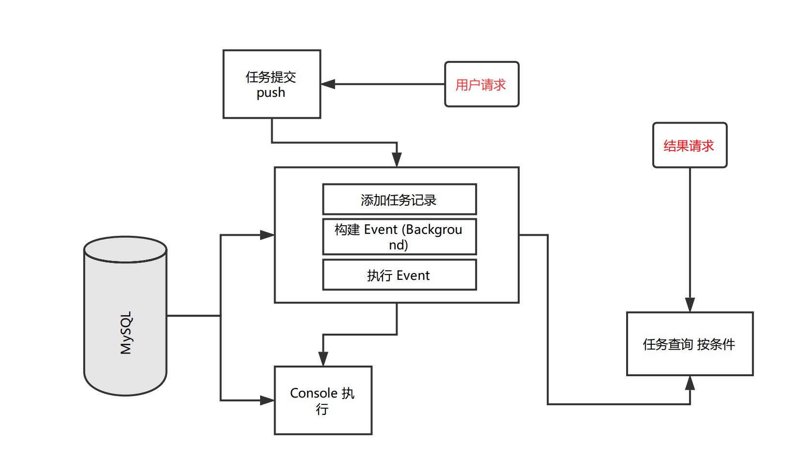

# Background-Tasks

**让你的 Functions 支持后台执行**

Laravel 扩展包，基于 MySQL 后台任务管理工具，使用 Laravel Event Console 执行任务，负责管理和监控任务代码执行状态，让后台任务执行更简单。



## Composer 安装

仓库源：https://packagist.org/packages/chester/background-mission

```bash
composer require chester/background-mission
```

## MySQL Migration

创建数据表：不创建数据表是无法正常提交任务的

```bash
background-tasks/src/2018_11_14_104840_test.php
```

配置 Provider：

```php
 Chester\BackgroundMission\Providers\MissionProvider::class
```

## 命令测试

添加任务：

```markdown
$ php artisan mission:test-add-task
```

查看任务列表：

```markdown
$ php artisan mission:records
+------------------+--------------------------+--------+---------+--------+-------------------+
| unique_id        | method                   | type   | state   | params | content           |
+------------------+--------------------------+--------+---------+--------+-------------------+
| gngkiytndfratiho | helloWorldAfter15Seconds | system | success | []     | after 15 seconds. |
+------------------+--------------------------+--------+---------+--------+-------------------+
```

## 自定义 Logic Functions

新建类：

```php
<?php
namespace App;

use Chester\BackgroundMission\Logic;

class TestLogic extends Logic
{
    public function myTest()
    {
        sleep(20);
        return $this->response(1, 'my test');
    }
}
```

添加配置项 config/const.php：

```php
'background_logic' => '\App\TestLogic'
```

测试任务提交：

```php
Route::get('bg-test', function () {
    app('chester.bg.queue')->push(['method' => 'myTest'])->runTask();
});
```

查看任务列表：

myTest 这个方法正在执行中。

```markdown
$ php artisan mission:records      
+------------------+--------+--------+-----------+--------+---------+
| unique_id        | method | type   | state     | params | content |
+------------------+--------+--------+-----------+--------+---------+
| rtrrvdedljvqdvcv | myTest | system | executing | []     |         |
+------------------+--------+--------+-----------+--------+---------+
```

20秒后，再次查看任务列表：

myTest 执行完成，并输出 'my test'

```markdown
$ php artisan mission:records      
+------------------+--------+--------+-----------+--------+---------+
| unique_id        | method | type   | state     | params | content |
+------------------+--------+--------+-----------+--------+---------+
| tjyfakjpdghjgvba | myTest | system | success   | []     | my test |
+------------------+--------+--------+-----------+--------+---------+
```

## 代码调试

以前修改扩展包时，总是为调试而头疼。现在，我推荐一种开发调试方式：

1.首先，克隆一份 laravel 源代码；
2.然后在 laravel 根目录下将你的扩展包克隆下来，
3.然后配置 laravel composer.json 映射 package 目录，就可以开始测试（ provider alias ）

修改完代码，直接提交就 OK
